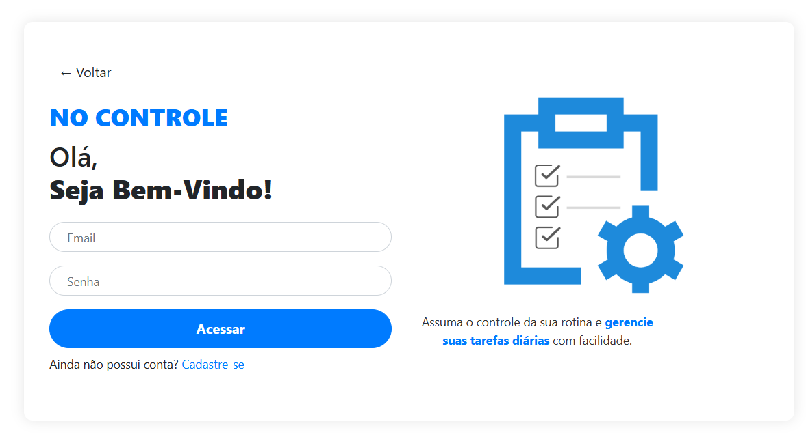
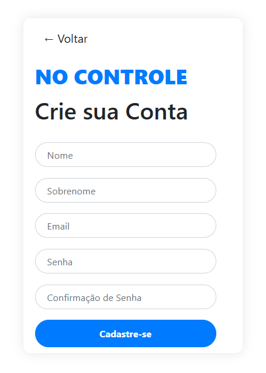
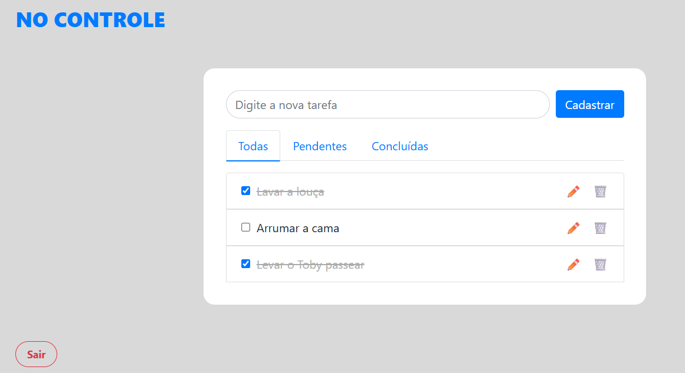

#  No Controle 

O projeto **No Controle** é uma aplicação web desenvolvida com Django, para o gerenciamento de tarefas diárias. Permite que usuários cadastrem, editem, excluam e filtrem tarefas como "pendentes", "concluídas" e "todas".

## 👩‍💻 Desenvolvedora

**Giulia Barros**

## 🖥️ Interfaces

### Home


### Login


### Cadastro


### Tarefas


## 🎮 Funcionalidades

- Cadastro e login de usuários
- Autenticação com e-mail e senha
- Criação, edição e exclusão de tarefas
- Marcar tarefas como concluídas
- Filtro de tarefas por status (todas, pendentes, concluídas)

---

## 🛠️ Tecnologias Utilizadas

### Backend
- [Python 3.12](https://www.python.org/)
- [Django 5.2.3](https://www.djangoproject.com/)
- MySQL

### Frontend
- HTML5 + CSS3
- Bootstrap 4
- Estilo customizado em arquivos CSS separados

### Outros
- Django Class Based Views (CBVs)
- django-stdimage
- WhiteNoise (para servir arquivos estáticos)

---

## ⚙️ Instalação e Execução Local

1. **Clone o repositório**
   ```bash
   git clone https://github.com/Giulia-Barros/no-controle.git
   cd no-controle
    ```
2. **Instale as dependências**
    ```bash
   pip install -r requirements.txt
    ```
   
3. **Configure o Banco de Dados**

    Edite o `settings.py` com as credenciais do seu banco MySQL:

    ```python
    DATABASES = {
        'default': {
            'ENGINE': 'django.db.backends.mysql',
            'NAME': 'no_controle',
            'USER': 'root',
            'PASSWORD': 'sua_senha',
            'HOST': 'localhost',
            'PORT': '3306',
        }
    }
    ```
4. **Execute as migrações**
    ```bash
    python manage.py makemigrations
    python manage.py migrate
    ```
5. Inicie o servidor
    ```bash
    python manage.py runserver
    ```
## 📁 Estrutura do Projeto

```arduino
no-controle
├── assets/
│     ├── cadastro.png
│     ├── home.png
│     ├── loign.png
│     └── tarefas.png
├── core/
│    ├── static/
│    │   ├── css/
│    │   │   ├── cadastro.css
│    │   │   ├── home.css
│    │   │   ├── loign.css
│    │   │   └── tarefas.css
│    │   └── img/
│    │       ├── controle.png
│    │       └── tarefas.png
│    ├── templates/
│    │   ├── cadastro.html
│    │   ├── home.html
│    │   ├── login.html
│    │   ├── tarefas.html  
│    │   │ 
│    │   │   
│    ├── views.py
│    ├── models.py
│    ├── forms.py
│    └── urls.py
├── nocontrole/
│    ├── settings.py
│    ├── urls.py
├── gitignore
├── manage.py
├── README.md
├── requirements.txt
```
---

## 💡 Melhorias Futuras

- Opção de redefinir a senha
- Experiência do usuário
- Data e/ou hora para incio e fim da tarefa
- Seperar as tarefas por dia da semana